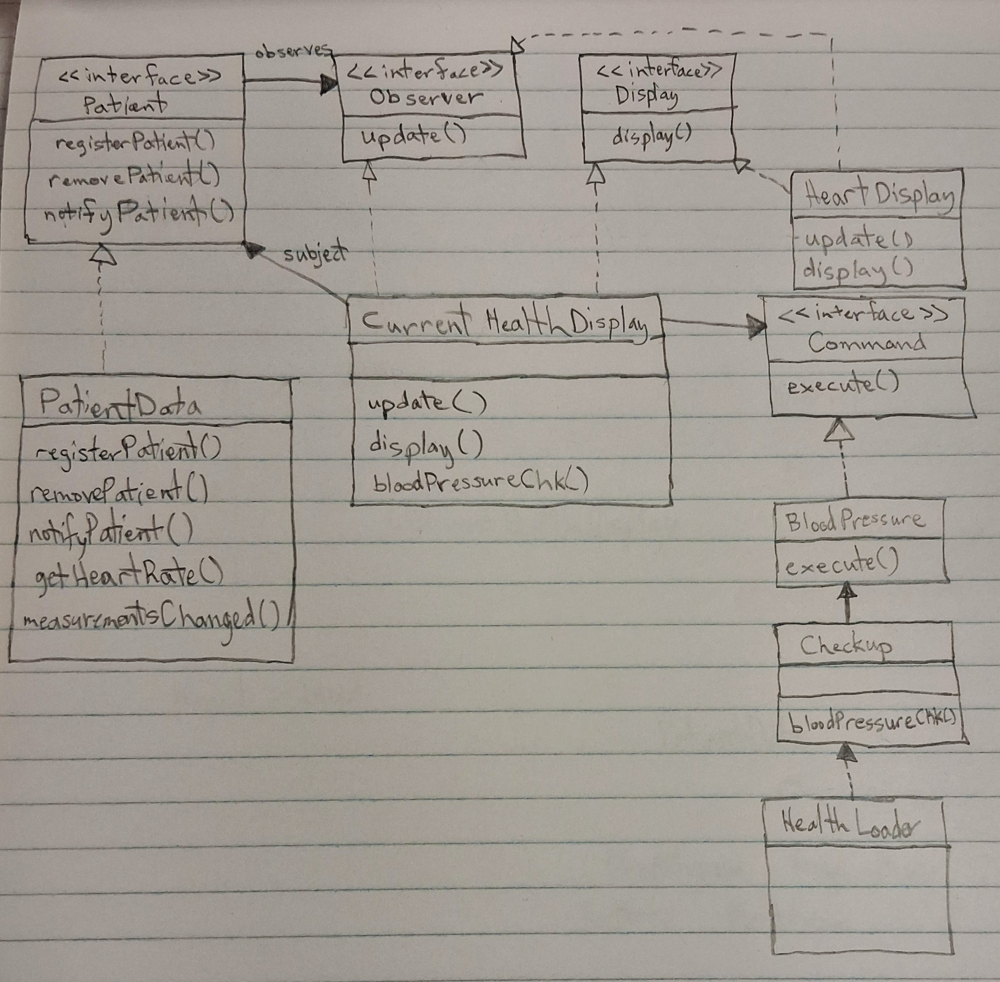
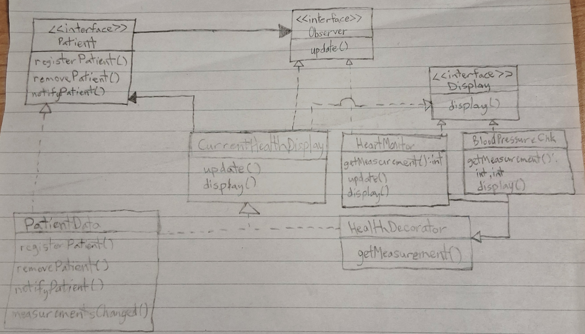

#### Solution 1

Any going data monitored shall be updated using the Observer Design Pattern.
Any data that will be shown via a button or some other toggle shall be displayed using the Command Design Pattern.
Since the amount of features desired is unknown, the amount of slots dedicated to toggle features must be updated every time a new feature that requires a toggle is implemented.

#### Solution 2

The Decorator Design Pattern allows for more flexibility on the inclusion of features.
When a new decorator gets added to the system, the Observer Design Pattern shall add that observer if data going through there must be displayed.
